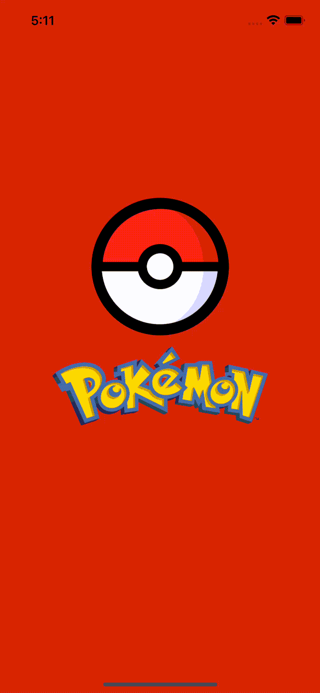

# Features

*The quality of gifs is quite low because of compression*

---

## Splash screen
Initial animation displayed after opening the app.

---

## Pokemon list
### Displaying the list of all Pokemon
The main screen of the app that features infinite scroll list of Pokemon and the ability to search for the specific Pokemon with its name.

### Searching for the specific Pokemon
You can open the search bar and type in the name of the Pokemon you want to display. The search bar will show search suggestions and allow you to either choose a single Pokemon from the suggestions list or display all suggested Pokemon.

---

## Pokemon details
### Details screen
This screen contains the most essential Pokemon information summarized in a user-friendly way.

### Pokemon gallery
The full screen gallery displaying images of the Pokemon.

---

## Favorites screen
This screen displays all Pokemon added to favorites. It uses a draggable grid that makes it easy to reorganize user's favorites and remove specific Pokemon from favorites.

---

## Map screen
*TODO - unfortunately, I have no time to finish this screen. Maybe it will be added in the future.*

---

## Themes screen
This screen displays the theme selector and the light/dark mode switch. There are 8 predefined themes, each of which has the light and the dark mode available.

